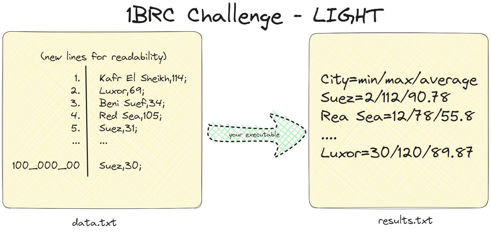

# 1brc light

An easier version of the famous [1BRC challenge](https://github.com/gunnarmorling/1brc)

## Problem

This is an easier version, we will be working with only 100 million rows, measurements will be integers instead of floats.
<br>
__Entries are delimted by semicolon not new lines.__



The text file contains temperature values for a range of cities (weather stations). Each row is one measurement in the format `<string: city name>,<int: measurement>`. The following shows some rows as an example with new lines for readability:
```
Kafr El Sheikh,114;
Luxor,69;
Beni Suef,34;
Red Sea,105;
Suez,31;
Suez,30;
Dakahlia,112;
Suez,78;
Luxor,110;
Matrouh,66;
Alexandria,112;
Cairo,105;
Gharbia,51;
```

The task is to write a program which reads the file, calculates the min, mean, and max temperature value per city, and emits the results on stdout or a file like this (i.e. sorted alphabetically by station name, and the result values per station in the format <min>/<mean>/<max>, rounded to one fractional digit):

```
Suez=23/18/59.2
Red Sea=16/26/67.3
...
Luxor=30/120/89.87
```

## Data generation

This Go function helps you create a data file containing 100 million random rows, each representing an Egyptian governorate.

```go
func Generate(filepath string) {
	governorates := []string{
		"Cairo", "Alexandria", "Giza", "Qalyubia", "Port Said",
		"Suez", "Luxor", "Aswan", "Asyut", "Beheira",
		"Beni Suef", "Dakahlia", "Damietta", "Faiyum", "Gharbia",
		"Ismailia", "Kafr El Sheikh", "Matrouh", "Minya", "Monufia",
		"New Valley", "North Sinai", "Red Sea", "Sharqia", "Sohag",
		"South Sinai",
	}

	rangesMin := []int{0, 100, 30}
	rangesMax := []int{100, 120, 70}

	file, err := os.OpenFile(filepath, os.O_WRONLY|os.O_CREATE, 0644)
	if err != nil {
		log.Fatal(err)
	}

	defer file.Close()

	writer := bufio.NewWriter(file)
	defer writer.Flush()

	for i := 0; i < 100_000_000; i++ {
		govIndex := rand.Intn(26)
		rangeIndex := rand.Intn(3)
		mn, mx := rangesMin[rangeIndex], rangesMax[rangeIndex]
		temp := rand.Intn(mx-mn) + mn
		fmt.Fprintf(writer, "%s,%d;", governorates[govIndex], temp)
	}
}
```

### Using the Compiled Binary
Don't have Go installed? No problem! You can still use the provided compiled program to generate your data file.

**Here's what you need to do:**

1. Download the Binary: Locate the [generation-binaries](./generation-binaries) folder within the provided resources. This folder contains the compiled binary executable.

2. Run the Program: Open a terminal or command prompt and navigate to the directory containing the downloaded build folder.

**The following commands demonstrate how to use the program:**

```Bash
$ ./1rbc-light-gen <number_of_rows> <output file path>

# Example: Generate 100 million rows and save them to data.txt
$ ./1rbc-light-gen 100000000 data.txt
```
* Replace <number_of_rows> with the desired number of data rows to generate (default is 100 million).
* Replace <output file path> with the filename and location where you want to save the generated data.

## Entering the Challenge

To submit your own implementation, follow these steps:

1. **Fork the Repository**.
2. **Choose Your Language:** Pick the programming language you used for your solution. If there isn't already a directory for that language, go ahead and create one.
3. **Claim Your Code Space:** Create a new directory inside the chosen language directory. Name this new directory using your GitHub username. This will keep your code organized and separate from others.
4. **Write Your Solution:** Dive in and write your amazing implementation within your newly created directory.
5. **Create a pull request against the upstream repository**.
